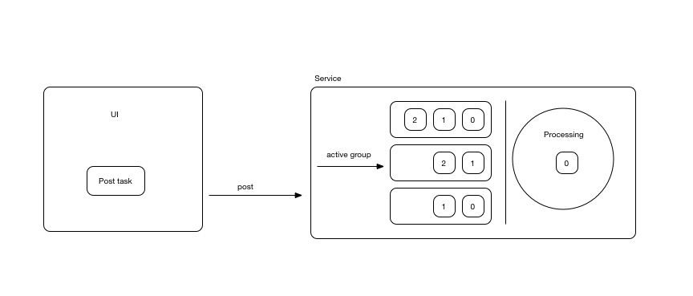

# Description

# Setup

Add it in your root build.gradle at the end of repositories:

	allprojects {
		repositories {
			...
			maven { url 'https://jitpack.io' }
		}
	}

Add the dependency

	dependencies {
	        compile 'com.github.nhancv:nc-android-ntask:${version}'
	}

# Usage

